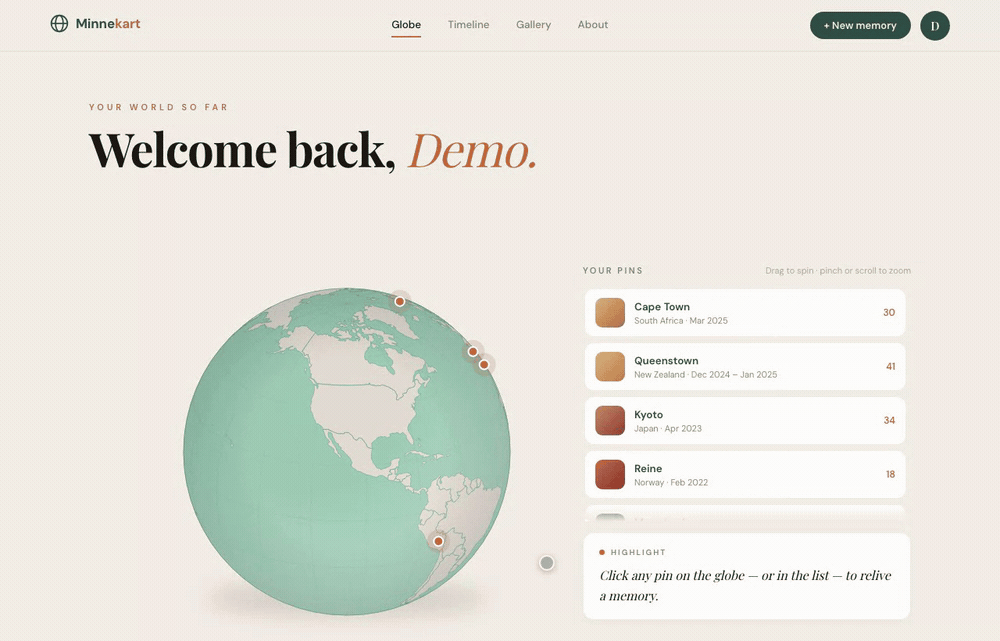

# Minnekart

Your journeys, mapped. A personal travel memory site: an interactive globe
where every pin is a place you've stood, opening into the story, dates, and
photographs of that visit.

[](https://github.com/heinhtetoo/minnekart/actions/workflows/ci.yml)
[](https://minnekart.vercel.app)



_Drag to spin, click a pin, and the globe flies to it while the memory card
fills in. The live site is invite-only, so the public URL shows the logged-out
globe rather than a tour._

## What it is

Minnekart ("memory map" in Norwegian) is a private travel journal built around
a globe rather than a feed. You pin the places you've been; each pin holds the
dates, a highlight, a longer story, and the photographs from that trip. Trips
stay private by default, and any one of them can be handed to a friend as a
signed share link.

It is a real, deployed application rather than a demo — invite-only signup,
email verification, photo uploads straight to object storage, and a public
profile page for anyone who wants to show their globe off.

## Highlights

- **An interactive D3 globe, not a map widget.** Orthographic projection over
  `d3-geo` and topojson, with the world atlas bundled into the app — no
  map-tile vendor, no API key, no per-view cost. Drag to spin, pinch or scroll
  to zoom, click a pin and the globe eases across to centre it.
- **Hand-rolled invite-only auth.** argon2id (m=19456, t=2, p=1), opaque
  session tokens stored only as SHA-256 hashes, 30-day sliding expiry renewed
  past the halfway mark, OTP email verification with attempt caps, and
  database-backed rate limiting on the login and signup paths.
- **176 tests across 38 files, integration-first.** They run against a real
  Postgres service container in CI, not mocks — route handlers are exercised
  end to end against actual SQL, so migrations and constraints are covered too.
- **Direct-to-R2 photo uploads.** Presigned `PUT` straight from the browser,
  short-lived signed `GET` for display, with EXIF and HEIC handling done
  client-side. Storage sits behind an `ObjectStorage` interface
  (`src/lib/storage/types.ts`) with `r2` and `memory` drivers.
- **Roughly $0/month.** Vercel, Neon and R2 free tiers, with backups taken by
  `pg_dump` (database) and an `rclone` mirror (photos) on a Tailscale-only box
  that never sits in the request path.

## Stack

| Layer     | Choice                                                               |
| --------- | -------------------------------------------------------------------- |
| Framework | Next.js 16 (App Router), React 19, TypeScript in strict mode         |
| Database  | Neon Postgres via Drizzle ORM, migrations checked into `drizzle/`    |
| Auth      | Hand-rolled: argon2 passwords, database-backed sessions, invite-only |
| Storage   | Cloudflare R2 over the S3 API, presigned upload and display URLs     |
| Email     | Abstracted `sendEmail()`; Resend API in prod, console output in dev  |
| Styling   | CSS Modules, co-located per component                                |
| Testing   | Vitest, integration-first against real Postgres                      |
| Hosting   | Vercel: `main` deploys production, `dev` deploys the preview         |

The absences are deliberate: no CSS framework, no auth library, no component
library. The dependency list is short and every entry earns its place.

## Design decisions

A few of the calls worth defending. All nine, with their reasoning, are in
[PRD.md](./PRD.md).

**Database sessions over stateless JWT.** JWTs cannot be revoked without
building the very session table they were meant to avoid. Minnekart needs
revocation — resetting a password kills every existing session, and the owner
can kick a user — so the sessions live in Postgres and the cookie carries
nothing but an opaque token.

**Rejected all-Cloudflare.** Workers + D1 + R2 was seriously considered and
turned down: the Workers free tier's ~10 ms CPU cap collides with argon2's cost
parameters (the workaround is either weaker hashing or $5/month), D1 offers
batch-only transactions where the auth flows need interactive ones, and Next.js
on Workers rides a community adapter with feature lag. Cloudflare stays scoped
to R2, so either side remains independently swappable.

**Seams where the cloud would otherwise be.** Email and storage each sit behind
an interface with a local driver — `console` email, `memory` storage. That is
why the app clones and runs with no cloud accounts at all, and it is the same
seam the integration tests bind to.

## Getting started

The defaults in `.env.example` use console email and in-memory storage, so no
cloud accounts are needed to run the app locally.

```sh
cp .env.example .env   # adjust if needed
docker compose up -d   # local Postgres on port 5433
npm install
npm run db:migrate     # apply migrations to a fresh database
npm run seed           # 7 demo trips to put pins on the globe
npm run dev
```

The seeded demo user deliberately cannot log in. To get an account you can sign
in with:

```sh
npm run create-owner -- you@example.com you "Your Name" a-strong-password
```

Signup is invite-only; `npm run create-invite` mints a token once an owner
exists.

## Checks

CI runs exactly these four, against a real Postgres service container:

```sh
npm run lint
npm run format:check
npm run typecheck
npm test
```

## Project layout

```
src/app/          App Router pages and route handlers (api/auth, api/trips, …)
src/components/   Feature-grouped components with co-located CSS Modules
src/lib/          Domain logic: auth, trips, photos, storage, email, env
src/db/           Drizzle schema, connection pool, demo seed
src/data/         Bundled world-110m topojson and demo trips
test/             Integration-test helpers: db reset, auth fixtures, HTTP
drizzle/          Generated SQL migrations
```

## Docs

- [PRD.md](./PRD.md) — product requirements, system design, and the full set of
  decisions with their rationale.
- [progress.md](./progress.md) — the implementation plan, phase by phase, as it
  was actually worked through.
- [BACKLOG.md](./BACKLOG.md) — what is knowingly left undone, and why.
- [docs/OPS.md](./docs/OPS.md) — runbook: environment variables, email and
  storage setup, backups, and the restore drill.

## Licence

All rights reserved. The source is public so it can be read, but it carries no
licence: it is not free to use, copy, modify, or deploy. If you'd like to do
something with it, ask.
